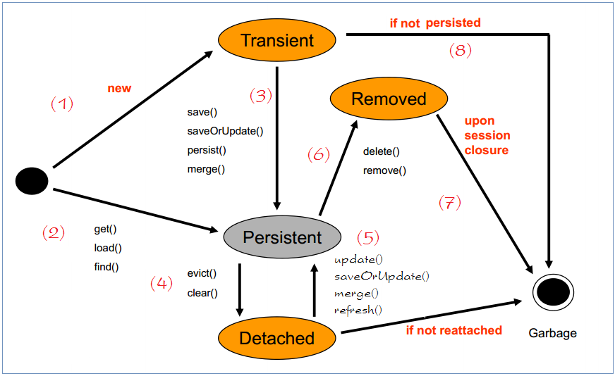

# HIBERNATE - SESSION

- `Session` trong hibernate được sử dụng để kết nối tới cơ sở dữ liệu trong một phiên làm việc nhất định
- `Session` không nên mở trong 1 thời gian dài vì nó không an toàn, nó nên được mở ra và đóng vào sau khi sử dụng
- `Session` cung cấp các phương thức để select, thêm sửa xóa đối tượng
- Một đối tượng được hibernate xem xét là tồn tại dưới 1 trong 3 dạng sau:

    - `transient`: chỉ là object java bình thường, chưa được hibernate quản lý và dĩ nhiên khong thao tác bằng session được
    
    - `persistent`: đối tượng được hibernate quản lý, class trong java đại diện cho 1 bảng của db (vd: class Student) ta sử dụng được session để thao tác với object này như lưu vào db, sửa, xóa từ db, ..
    
    - `detached`: đối tượng từ persistent trở thành do đóng session, đối tượng này sẽ được hibernate xóa đi
    
- Nên sử dụng `transaction` để tránh các trường hợp mất mát dữ liệu không mong muốn

### [CÁC TRẠNG THÁI CỦA OBJECT KHI HOẠT ĐỘNG VỚI HIBERNATE](https://o7planning.org/vi/10201/huong-dan-lap-trinh-java-hibernate-cho-nguoi-moi-bat-dau)

Khi hoạt động với hibernate, chúng ta cần biết được các trạng thái của một object để quản lý và sử dụng sao cho phù hợp

Các trạng thái bao gồm:
- `transient`
- `persitent`
- `detached`
- `removed`

#### 1. `TRANSIENT`

Trường hợp bạn tạo mới một đối tượng java từ một `Entity`, đối tượng đó sẽ có trạng thái là `Transient`.
Hibernate không biết về sự tồn tại của nó. Nó nằm ngoài sự quản lý của Hibernate.
Và tất nhiên hibernate sẽ không quản lý obj này, mà là java sẽ quản lý.

#### 2. `PERSITENT`

Trường hợp bạn lấy ra đối tượng Entity thông qua các phương thức `get`, `load`, `find`, `getSingleResult`,..
bạn có được một đối tượng nó tương ứng với 1 bản ghi dưới database. Đối tượng này có trạng thái `persistent`.
Nó được quản lý bởi Hibernate.
Ngoài ra, để chuyển 1 obj được tạo từ Entity từ `transient` thành `persitent` thì ta có thể sử dụng các hàm
`save`, `saveOrUpdate`, `persist`, `merge`

#### 3. `DETACHED`

Là trạng thái tách ra từ `persitent`, nói cách khác là thoát khỏi sự quản lý của Hibernate
1 obj từ trạng thái `persistent` có thể sử dụng hàm `evict` hoặc `clear` để chuyển thành trạng thái `detached`
và ngược lại, 1 obj đang ở trạng thái detached ta có thể sử dụng phương thức `update`, `save`, `merge`, `saveOrUpdate`, `refresh`
để chuyển trạng thái của nó về thành `persistent` do hibernate quản lý

#### 4. `REMOVE`

Là trạng thái bị xóa, bị loại bỏ từ trạng thái `pesistent`, nghĩa là khi 1 obj đang ở `persistent`,
ta gọi hàm `remove()` hoặc `delete()` để chuyển trạng thái của nó về thành `remove`,
nó bị xóa, tương đương với 1 record trong DB bị xóa
